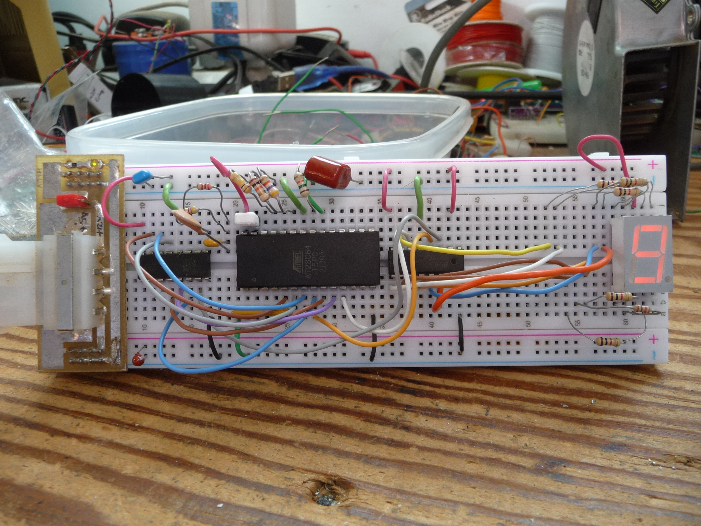

# FSM595
ROM image to drive multiple serial streams to 74595 chips.

Please ignore most of the comments in main.c. The file is recycled a lot and I did not update them.
Just skip to main() and read that.

This is a test case for an idea to use a ROM to generate multiple serial streams for 74595 chips. Each data line of the rom can carry a serial data stream. The unused address lines of the chip can be used to determine the stream that is sent to the chips. This can be looped back to form a state machine. 

This example, when A6 is low, generates 7 segment data for "8675309 "
When A6 is high, it generates 7 segment data for "JEn nY   "

This uses a CD4060 as an oscillator, bit counter, and character counter.
A 28C64 EEPROM is used to generate the data stream
A 74HC595 is used to drive the segments of the display. The bit clock and output latch come from the CD4060.

